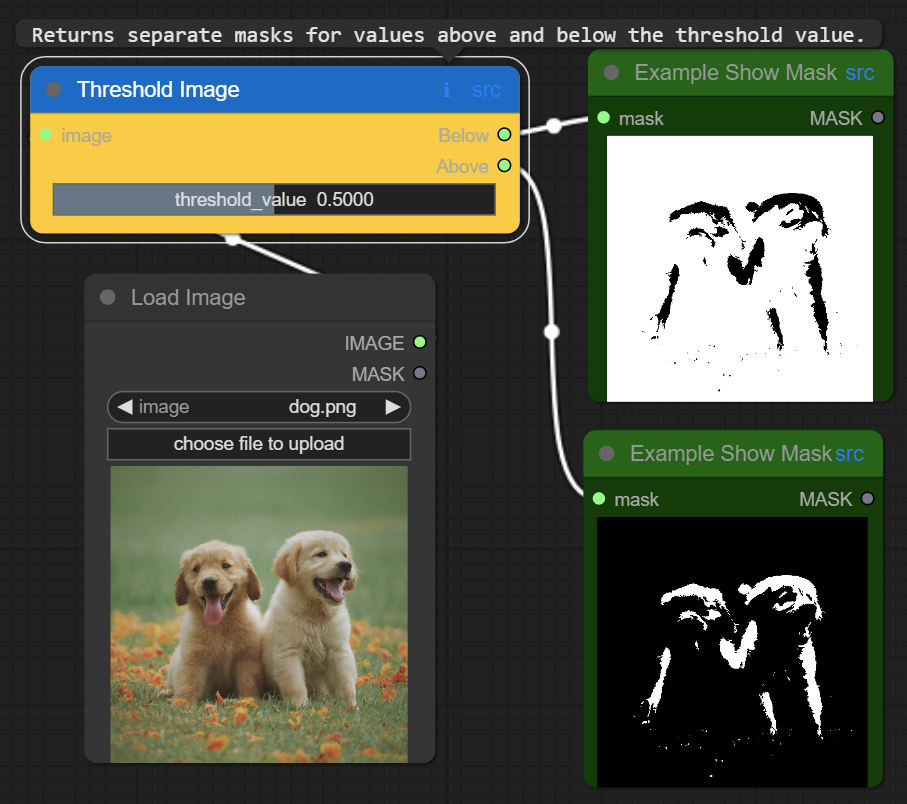
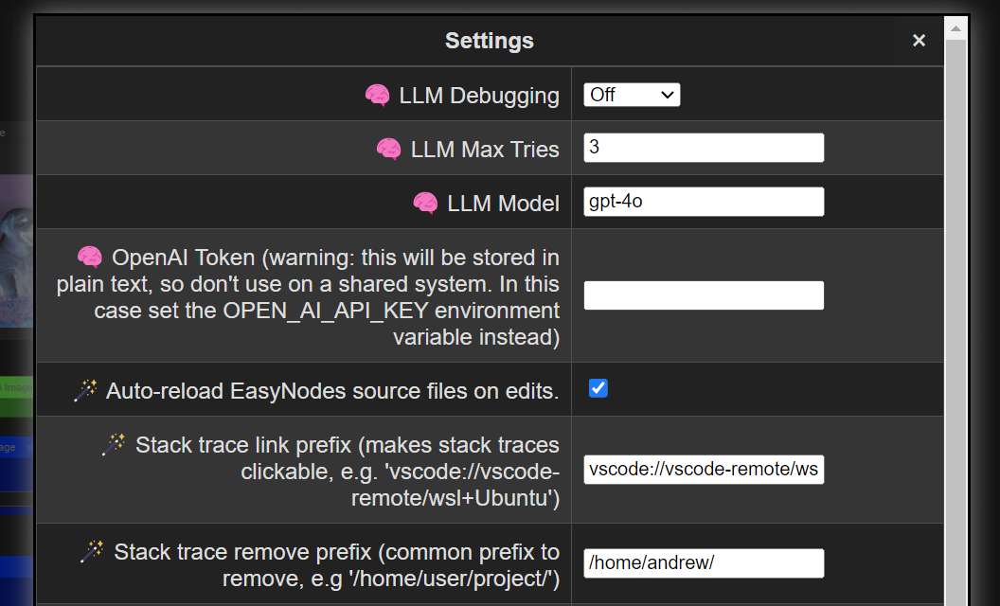

# Effortless Nodes for ComfyUI

This package aims to make adding new [ComfyUI](https://github.com/comfyanonymous/ComfyUI) nodes as easy as possible, and provide a some customization options through pure Python that were previously only accessible through JavaScript.

It processes your function's Python signature to create the node definition ComfyUI is expecting. All you have to do is annotate your inputs and outputs and add the `@ComfyNode` decorator.

For example:
```python
from easy_nodes import ComfyNode, ImageTensor, MaskTensor, initialize_easy_nodes
easy_nodes.initialize_easy_nodes()

@ComfyNode("Example category", color="#0066cc", bg_color="#ffcc00", return_names=["Below", "Above"])
def threshold_image(image: ImageTensor, threshold_value: float = NumberInput(0.5, 0, 1, 0.0001, display="slider")) -> tuple[MaskTensor, MaskTensor]:
    """Returns separate masks for values above and below the threshold value."""
    mask_below = torch.any(image < threshold_value, dim=-1)
    return mask_below.float(), (~mask_below).float()
```

That's it! Now your node is ready for ComfyUI. More examples can be found [here](example/example_nodes.py).

Sample node with tooltip and deep source link:



New settings:




Note that ImageTensor/MaskTensor are just syntactic sugar for semantically differentiating the annotations (allowing ComfyUI to know what plugs into what); your function will still get passed genunine torch.Tensor objects.

For more control, you can call easy_nodes.init(...) and change some settings that will apply to all nodes you create.

## New in 1.0.0:

- Renamed to ComfyUI-EasyNodes (from ComfyUI-Annotations) to better reflect the package's goal (rather than the means)
- Automatic module reloading: if you edit your node source, immediately see the changes
- LLM-based debugging: optionally have ChatGPT take a crack at fixing your code
- Set node colors via Python argument (no JavaScript required)
- Add preview text and images to nodes via show_text and show_image Python functions, no JavaScript required.
- Automatically create nodes with widgets to set the fields of existing Python objects.
- Tooltips and deep links to node source code
- Bug fixes

## Features

- **@ComfyNode Decorator**: Simplifies the declaration of custom nodes with automagic node declaration based on Python type annotations. Existing Python functions can be converted to ComfyUI nodes with a simple "@ComfyNode()"
- **Built-in text and image previews**: Just call `easy_nodes.add_preview_text()` and `easy_nodes.add_preview_image()` in the body of your function and EasyNodes will automatically display it, no JavaScript hacking required.
- **Set node color easily**: No messing with JavaScript, just tell the decorator what color you want the node to be.
- **Type Support**: Includes several custom types (`ImageTensor`, `MaskTensor`, `NumberInput`, `Choice`, etc.) to support ComfyUI's connection semantics and UI functionality. Register additional types with `register_type`.
- **Automatic list and tuple handling**: Simply annotate the type as e.g. ```list[torch.Tensor]``` and your function will automatically make sure you get passed a list. It will also auto-tuple your return value for you internally (or leave it alone if you just want to copy your existing code).
- **Init-time checking**: Less scratching your head when your node doesn't fire off properly later. For example, if you copy-paste a node definition and forget to rename it, @ComfyNode will alert you immediately about duplicate nodes rather than simply overwriting the earlier definition.
- **Supports most ComfyUI node definition features**: validate_input, is_output_node, etc can be specified as parameters to the ComfyNode decorator.
- **Convert existing data classes to ComfyUI nodes**: pass `create_field_setter_node` a type, and it will automatically create a new node type with widgets to set all the fields.
- **LLM-based debugging**: Optional debugging and auto-fixing of exceptions during node execution. Will automatically create a prompt with the relevent context and send it to ChatGPT, create a patch and fix your code.


## Installation

To use this module in your ComfyUI project, follow these steps:

1. **Install the Module**: Run the following command to install the ComfyUI-EasyNodes module:

    ```bash
    pip install ComfyUI-EasyNodes
    ```
    or, if you want to have an editable version:
    ```bash
    pip install -e https://github.com/andrewharp/ComfyUI-EasyNodes
    ```
    Note that this is not a typical ComfyUI nodepack, so does not itself live under custom_nodes.
    
    However, after installing you can copy the example node directory into custom_nodes to test them out:
    ```bash
    git clone --depth=1 https://github.com/andrewharp/ComfyUI-EasyNodes.git /tmp/easynodes
    mv /tmp/easynodes/example $COMFYUI_DIR/custom_nodes/easynodes
    ```

3. **Integrate into Your Project**:
    - Open your ComfyUI project's `__init__.py` (e.g. `ComfyUI/custom_nodes/my_project/__init__.py`).
    - Make sure you're importing the module where you define your nodes:

    ```python
    import your_node_module
    ```

    Then, in `your_node_module.py`:
    ```python
    from easy_nodes import ComfyNode, NumberInput, ImageTensor, initialize_easy_nodes

    easy_nodes.initialize_easy_nodes(default_category=my_category)

    @ComfyNode()
    def create_random_image(width: int=NumberInput(128, 128, 1024), 
                            height: int=NumberInput(128, 128, 1024)) -> ImageTensor:
        return torch.rand((1, height, width, 3))
    ```

    If you run into problems with the auto-registration, you can try turning it off and give ComfyUI your node mappings the regular way:
    <details>

    In `__init__.py`:

    ```python
    import easy_nodes
    import your_node_module

    NODE_CLASS_MAPPINGS, NODE_DISPLAY_NAME_MAPPINGS = easy_nodes.get_node_mappings()

    # Export so that ComfyUI can pick them up.
    __all__ = ['NODE_CLASS_MAPPINGS', 'NODE_DISPLAY_NAME_MAPPINGS']
    ```

    and in `your_node_module.py`:
    ```python
    import easy_nodes
    easy_nodes.initialize_easy_nodes(default_category=my_category, auto_register=False)

    @ComfyNode()
    def my_node(foo: int) -> int:
        return foo + 42
    ...
    ```

    </details>


## Initialization options

The options passed to `easy_nodes.initialize_easy_nodes` will apply to all nodes registered until the next time `easy_nodes.initialize_easy_nodes` is called.

The settings mostly control defaults and some optional features that I find nice to have, but which may not work for everybody, so some are turned off by default.

    - `default_category`: The default category for nodes. Defaults to "EasyNodes".
    - `auto_register`: Whether to automatically register nodes with ComfyUI (so you don't have to export). Defaults to True.
    - `docstring_mode`: The mode for generating node descriptions that show up in tooltips. Defaults to AutoDescriptionMode.FULL.
    - `verify_tensors`: Whether to verify tensors for shape and data type according to ComfyUI type (MASK, IMAGE, etc). Runs on inputs and outputs. Defaults to False, as I've made some assumptions about shapes that may not be universal.
    - `auto_move_tensors`: Whether to automatically move torch Tensors to the GPU before your function gets called, and then to the CPU on output. Defaults to False.


## Using the decorator

1. **Annotate Functions with @ComfyNode**: Decorate your processing functions with `@ComfyNode`. The decorator accepts the following parameters:
   - `category`: Specifies the category under which the node will be listed in ComfyUI. Default is `"ComfyNode"`.
   - `display_name`: Optionally specifies a human-readable name for the node as it will appear in ComfyUI. If not provided, a name is generated based on the function name.
   - `workflow_name`: The internal unique identifier for this node type. If not provided, a name is generated based on the function name.
   - `description`: An optional description for the node. If not provided the function's docstring, if any, will be used according to `easy_nodes.docstring_mode`.
   - `is_output_node`: Maps to ComfyUI's IS_OUTPUT_NODE.
   - `return_types`: Maps to ComfyUI's RETURN_TYPES. Use if the return type of the function itself is dynamic.
   - `return_names`: Maps to ComfyUI's RETURN_NAMES.
   - `validate_inputs`: Maps to ComfyUI's VALIDATE_INPUTS.
   - `is_changed`: Maps to ComfyUI's IS_CHANGED.
   - `always_run`: Makes the node always run by generating a random IS_CHANGED.
   - `debug`: A boolean that makes this node print out extra information during its lifecycle.
   - `color`: Changes the node's color.
   - `bg_color`: Changes the node's color. If color is set and not bg_color, bg_color will just be a slightly darker color.

    Example:
    ```python
    from easy_nodes import ComfyNode, ImageTensor, NumberInput

    @ComfyNode(category="Image Processing",
               display_name="Enhance Image",
               is_output_node=True,
               debug=True,
               color="#FF00FF")
    def enhance_image(image: ImageTensor, factor: NumberInput(0.5, 0, 1, 0.1)) -> ImageTensor:
        # Function implementation, do stuff to image.
        return image
    ```

2. **Annotate your function inputs and outputs**: Fully annotate function parameters and return types, using `list` to wrap types as appropriate. This information is used to generate the fields of the internal class definition `@ComfyNode` sends to ComfyUI. If you don't annotate the inputs, the input will be treated as a wildcard. If you don't annotate the output, you won't see anything at all in ComfyUI.

    Example:
    ```python
    @ComfyNode("Utilities")
    def add_value(the_list: list[ImageTensor], val: int) -> list[int]:
        return [img + the_value for img in the_list]
    ```

### Registering new types:

Say you want a new type of special Tensor that ComfyUI will treat differently from Images. Say, a rotation matrix. Just create a placeholder class for it and use that in your annotations -- it's just for semantics; internally your functions will get whatever type of class they're handed.

```python
class RotationMatrix(torch.Tensor):
    def __init__(self):
        raise TypeError("!") # Will never be instantiated

easy_nodes.register_type(RotationMatrix, "ROTATION_MATRIX")

@ComfyNode()
def rotate_matrix_more(rot1: RotationMatrix, rot2: RotationMatrix) -> RotationMatrix:
    return rot1 * rot2
```

Making the class extend a torch.Tensor is not necessary, but it will give you nice type hints in IDEs.

### Creating dynamic nodes from classes

You can also automatically create nodes that will expose the fields of a class as widgets (as long as it has a default constructor). Say you have a complex options class from a third-party library you want to pass to a node.

```python
from some_library import ComplexOptions

easy_nodes.register_type(ComplexOptions)

easy_nodes.create_field_setter_node(ComplexOptions)
```

Now you should be should find a node named ComplexOptions that will have all the basic field types (str, int, float, bool) exposed as widgets.

### Example Node Definition from ComfyUI's [example_node.py.example](https://github.com/comfyanonymous/ComfyUI/blob/master/custom_nodes/example_node.py.example), converted:

```python
from easy_nodes import ComfyNode, ImageTensor, MaskTensor, NumberInput, Choice, StringInput

@ComfyNode("Example")
def annotated_example(image: ImageTensor, 
                      string_field: str = StringInput("Hello World!", multiline=False),
                      int_field: int = NumberInput(0, 0, 4096, 64, "number"), 
                      float_field: float = NumberInput(1.0, 0, 10.0, 0.01, 0.001),
                      print_to_screen: str = Choice(["enabled", "disabled"])) -> ImageTensor:
    """Inverts the input image and prints input parameters based on `print_to_screen` choice."""
    if print_to_screen == "enable":
        print(f"""Your input contains:
            string_field: {string_field}
            int_field: {int_field}
            float_field: {float_field}
        """)
    return 1.0 - image
```

More examples can be found in [example_nodes.py](https://github.com/andrewharp/ComfyUI-Annotations/blob/main/example/example_nodes.py)


## Contributing

Contributions are welcome! Please submit pull requests or open issues for any bugs, features, or improvements.
